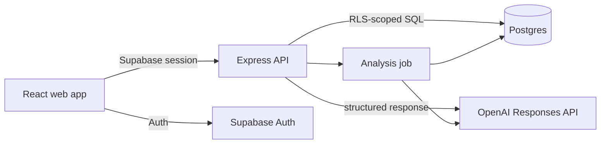

# SignalDesk architecture

## Product boundary

SignalDesk turns raw customer feedback into evidence-linked themes and prioritized actions. It is deliberately not a general chat interface: every AI claim must cite one or more feedback records and every run is auditable.

## System shape

- `apps/web`: React/Vite product UI, Supabase authentication, accessible dashboard.
- `apps/api`: Express API, authorization, rate limiting, usage metering, AI orchestration.
- `packages/contracts`: shared Zod request/response contracts.
- `supabase`: schema, row-level security policies, seed data.

## Trust boundaries

The browser never receives the OpenAI key or Supabase service-role key. The API verifies the Supabase JWT, derives workspace membership server-side, applies a per-user limiter, and records each AI attempt. Postgres RLS is the final tenant boundary; application checks are defense in depth.

## AI workflow

1. Select feedback records inside one workspace/project.
2. Normalize and redact obvious contact data.
3. Submit bounded source material plus an explicit JSON schema.
4. Validate output with Zod; reject uncited evidence IDs.
5. Persist run, themes, evidence edges, actions, latency, and token usage atomically.
6. Render insights with direct links to their supporting feedback.

In development, `AI_PROVIDER=mock` gives deterministic output without credentials. Production fails closed if provider configuration is missing.

## Reliability

- Idempotency keys prevent duplicate analysis runs.
- Analysis states are `queued`, `running`, `succeeded`, or `failed`.
- Provider timeouts and bounded retries avoid hanging requests.
- Structured logs include request and analysis IDs, never raw feedback text.
- Health and readiness endpoints separate process health from dependency health.

## Deliberate tradeoffs

The first release uses an in-process job runner to remain deployable on a small service. The job interface is isolated so production volume can move to a durable queue without changing API contracts. Similarity search and file ingestion are roadmap items; text feedback is the smallest complete, useful product loop.
