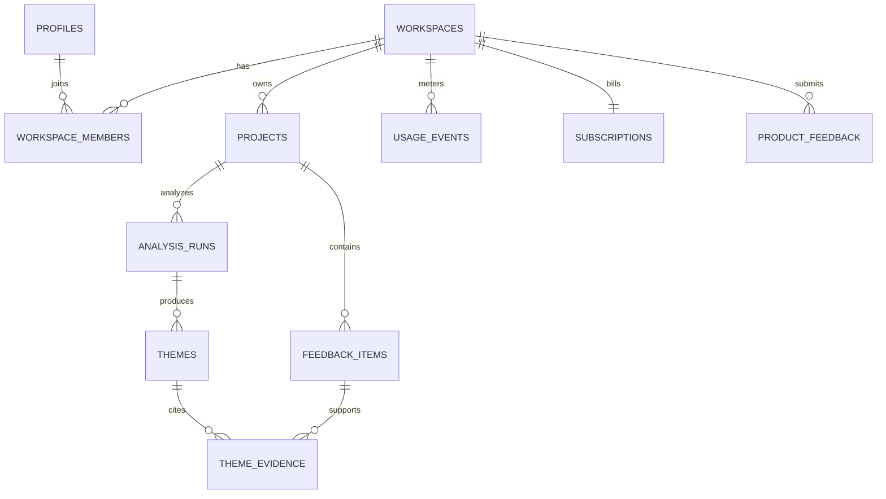

# Database and tenancy

## Core schema

## Tables

- `profiles`: public user profile keyed to `auth.users`.
- `workspaces`: tenant and plan boundary.
- `workspace_members`: user-to-workspace role (`owner`, `admin`, `member`, `viewer`).
- `projects`: a product or feedback stream.
- `feedback_items`: source, external reference, body, sentiment, metadata.
- `analysis_runs`: lifecycle, model, prompt version, counts, latency, error category.
- `themes`: structured synthesis, urgency, trend, recommendation.
- `theme_evidence`: many-to-many citation edges with a short rationale.
- `usage_events`: append-only units, tokens, and request metadata.
- `subscriptions`: mock billing state; provider IDs are nullable.
- `product_feedback`: in-app rating and comment.

## Tenant policy

Every tenant-owned table carries or can join to `workspace_id`. RLS policies call `is_workspace_member(workspace_id)`; writes additionally check roles. Clients cannot insert usage events or mutate analysis results. Service-role access is server-only.

## Data retention

Feedback and analyses are retained until workspace deletion in the starter plan. A production launch should add configurable retention, export, deletion jobs, regional storage, and a documented subprocessor list. Do not ingest secrets, health records, payment data, or other regulated data without a separate compliance review.
